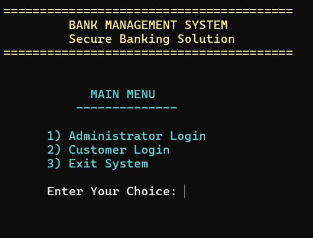

# Bank Management System (x86 Assembly)

A comprehensive, Assembly Language-based Bank Management System designed for secure banking operations. This application provides role-based access and real-time banking functions for administrators and customers.

---

## Preview

---

## Overview

This console application simplifies banking operations and resolves transaction conflicts through a clean, intuitive interface. It uses low-level programming, structured data handling, and persistent file storage—making it both practical and efficient.

---

## Key Features

### 1. Role-Based Access  
- **Administrators**: Full control over account management, deposits, withdrawals, and deletions with password protection.  
- **Customers**: Access personalized banking operations by entering account number and PIN.

### 2. Dynamic Account Management  
- **Account Creation**: Automatically creates new accounts with unique account numbers.  
- **Transaction Processing**: Tracks deposits, withdrawals, and transfers with balance validation.  
- **PIN Security**: Secure 4-digit PIN system with validation and change functionality.

### 3. Conflict Prevention  
- **Balance Validation Checks**: Ensures no transactions result in negative balances.  
- **Duplicate Account Prevention**: Prevents creation of accounts with duplicate account numbers.  
- **Input Validation**: Validates all user inputs to prevent system errors.

### 4. Data Persistence  
- **File-Based Storage**: Accounts are saved to `.dat` files for persistent data storage.  
- **Binary Data Tracking**: Uses structured binary files to track account information securely.

### 5. User-Friendly Interface  
- **Color-Coded Console**: Different colors for admin/customer panels and status messages.  
- **Real-Time Updates**: Customers see balance changes immediately after transactions.  
- **Error Handling**: Validates inputs (e.g., PIN format: `1000-9999`, positive amounts).

### 6. Admin Superpowers  
- **CRUD Operations**: Create, Read, Update, or Delete accounts for any customer.  
- **Force Transactions**: Admin-initiated deposits and withdrawals for any account.  
- **Overwrite Protection**: Confirmation prompts prevent accidental data loss.

### 7. Consolidated Views  
- Administrators see all accounts with status and balances (PINs masked as ****).  
- Customers have personalized access to their specific account only.

---

## Why It Stands Out

- ✅ **Scalable**: Handles multiple accounts with structured memory management  
- ✅ **Zero Dependencies**: Built in pure x86 Assembly — no high-level language required  
- ✅ **System-Level Fit**: Demonstrates mastery of low-level programming and memory management

---

## System Architecture
### Main Components
- `Account STRUCT`: Contains accountNum, pin, balance, and active status fields
- `Administrator` and `Customer` roles with separate access views
- `FileOperations`: Manages data persistence and retrieval

### Design Patterns
- **Modular Programming**: Self-contained procedures for each banking function
- **Structured Data Handling**: Uses Assembly STRUCTs for object-like organization
- **MVC-Like Separation**: Keeps user interface and business logic organized

### Data Handling
- `.dat` binary files for secure account data storage
- Structured memory allocation for account management
- Input buffers for secure user input processing

---

## Usage
### Customer Flow
1. Launch app → Select **Customer Login**
2. Enter account number (e.g., `1001`)
3. Enter PIN (e.g., `1234`)
4. Access your banking functions

### Admin Flow
1. Launch app → Select **Administrator Login**
2. Enter credentials (ID: `admin`, Password: `1234`)
3. Access dashboard to:
   - Create/delete accounts
   - View all account details
   - Force deposits/withdrawals
   - Manage system data

---

## Requirements

- Microsoft Macro Assembler (MASM)
- Irvine32 Library
- Compatible with 32-bit Windows systems
- Visual Studio IDE recommended

---

## Future Improvements

- Migrate to database storage for larger-scale use
- Add encryption for PIN and sensitive data
- Modularize code further for readability
- Add transaction history logging
- Implement interest calculation features

---

## License

This project is for academic and demonstration use. Please credit the developers if reused or modified for deployment.

## Developed By
BISMA SHAHID  
Department of Software Engineering  
FAST NUCES KHI
